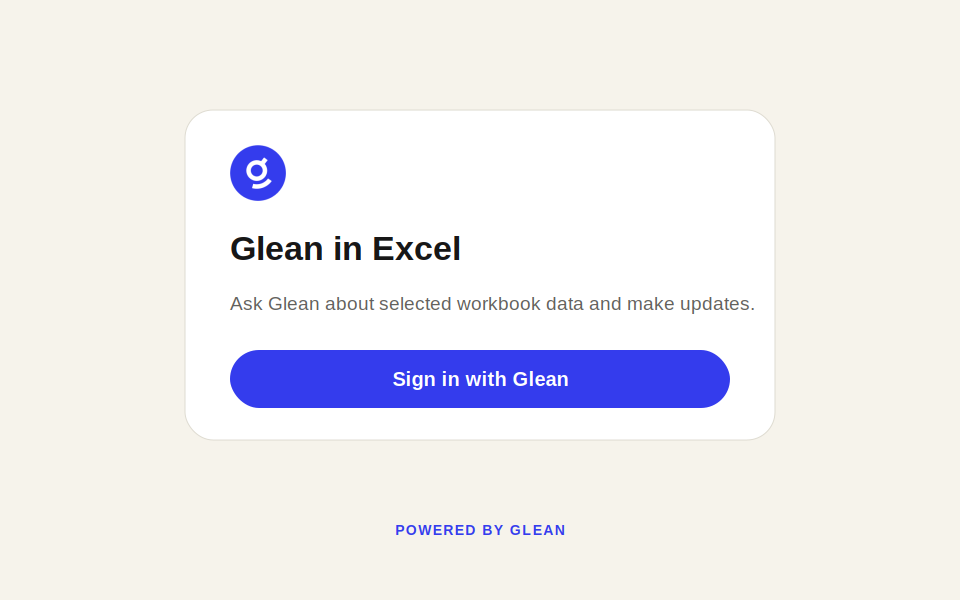
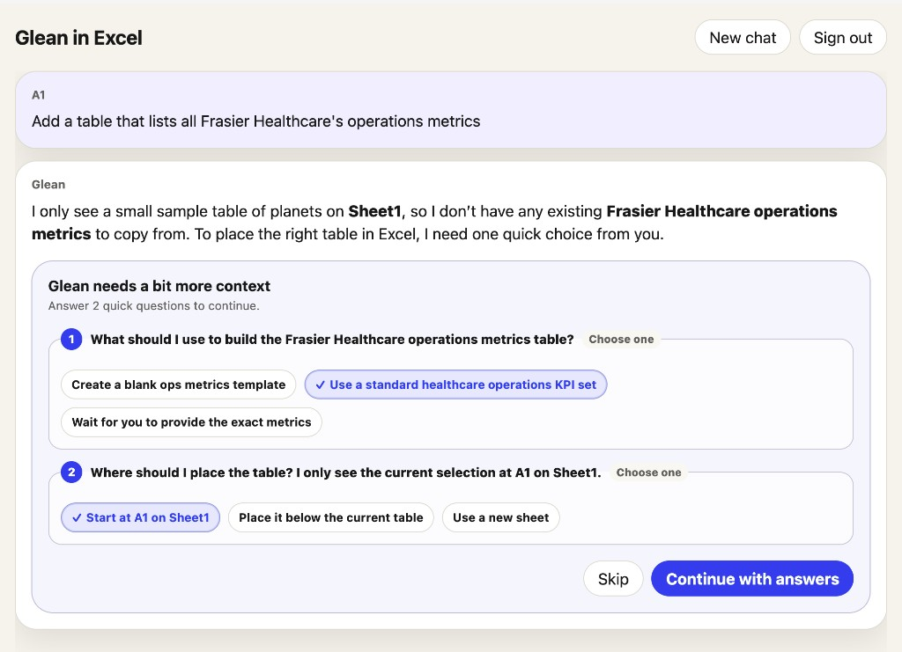
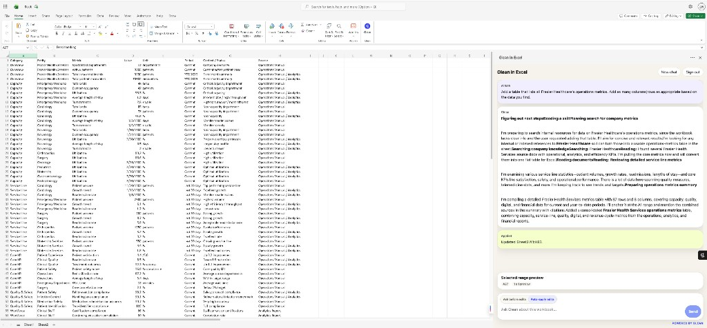
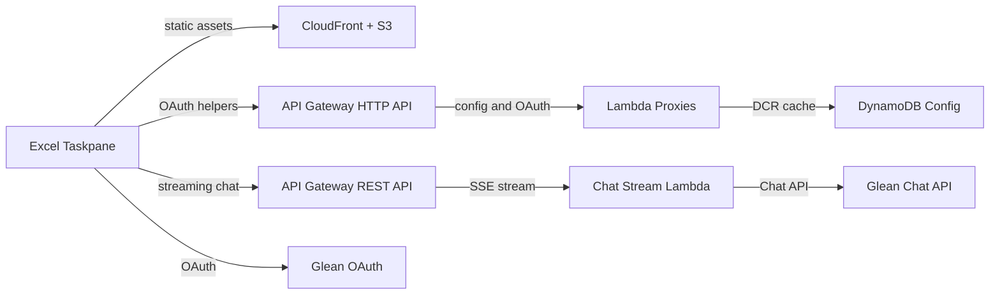

# Glean in Excel

Glean in Excel is a customer-deployable Microsoft Excel taskpane add-in. It lets users sign in with Glean OAuth, ask questions about selected workbook data, answer Glean clarification questions, and optionally let Glean make reviewed or auto-applied workbook updates.

This reference is a general Excel-aware assistant. It does not require customer-created Glean agents for the core experience.

## Screenshots

### Sign in



### Clarifying Questions



### Excel Result



## Features

- Glean OAuth Authorization Code + PKCE.
- Dynamic Client Registration by default; static OAuth client fallback.
- Excel selected-range context and capped workbook fallback previews.
- Context transparency with preview tables and cap notices.
- Glean Chat API with persistent `chatId` context and `New chat` reset.
- Long-running chat support through API Gateway REST response streaming.
- Structured Glean clarification questions via `ARTIFACT_USER_QUESTIONS`.
- Follow-up prompt chips when Glean returns `followUpPrompts`.
- Edit mode control: `Ask before edits` or `Auto-apply edits`.
- Preview-before-write for workbook updates.
- Microsoft 365 sideloading and centralized deployment-ready manifest generation.

## Architecture



The taskpane is hosted from a private S3 bucket through CloudFront. Most `/api/*` routes use API Gateway HTTP API and Lambda. `/api/chat` is routed separately to a Regional REST API with Lambda response streaming so long-running Glean answers can stay responsive without the 30-second HTTP API cap.

## Workbook Context

The add-in does not send the entire workbook by default.

- If the selected range has visible content, Glean receives a capped preview of the selected range.
- If the selection appears empty and workbook fallback is enabled, Glean receives a capped preview of used ranges across the workbook.
- The selected range preview is capped at `25 x 15`.
- Workbook fallback is capped at `25 x 15` per sheet across up to 8 sheets.
- Total context text is capped at 25,000 characters.
- The UI shows when context is capped so users can select a smaller range when needed.

## Glean Clarifying Questions

Glean can return structured clarification prompts as `ARTIFACT_USER_QUESTIONS` messages. The add-in renders these as question cards with single-select or multi-select options and sends answers back through `artifactInfo.action.clarifyingQuestionResponses` on the same `chatId`.

This flow is isolated in `src/services/chat.ts` because it is legacy `/rest/api/v1/chat` artifact semantics.

## Local Development

```bash
npm install
npm run dev
```

For Office sideloading, install dev certs and generate a local manifest:

```bash
npm run dev-certs
DOMAIN_NAME=localhost:3000 GLEAN_INSTANCE=your-instance node deployment/scripts/generate-manifest.mjs
npm run sideload
```

## Deploy to AWS

Copy the environment file and fill in deployment-specific values:

```bash
cp deployment/config/prod.env.example deployment/config/prod.env
```

If you need an ACM certificate and Route53 validation record for the configured domain:

```bash
./deployment/scripts/provision-certificate.sh prod
```

Deploy infrastructure:

```bash
./deployment/scripts/deploy-infrastructure.sh prod
```

Create or update the Route53 alias:

```bash
./deployment/scripts/upsert-route53-alias.sh prod
```

Deploy the app and generated manifest:

```bash
./deployment/scripts/deploy-app.sh prod
```

Install the hosted manifest from:

```text
https://<your-domain>/manifest.xml
```

## Required Deployment Inputs

- AWS profile/role with permission to deploy CloudFormation, S3, CloudFront, API Gateway, Lambda, DynamoDB, IAM, Route53, and ACM.
- ACM certificate ARN in `us-east-1`, or permission to create one.
- Route53 hosted zone for the add-in domain.
- Glean instance slug.
- OAuth mode:
  - recommended: `OAUTH_CLIENT_TYPE=dcr`
  - fallback: static OAuth client ID and secret
- Admin email list for config/admin routes.

## Validation

```bash
npm run check
npm audit --omit=dev
```

Manual QA checklist:

- Sign in with Glean OAuth.
- Ask about a selected range.
- Verify capped context notices and preview table rendering.
- Trigger a Glean clarification question and submit answers.
- Ask for a small workbook update with `Ask before edits`.
- Test `Auto-apply edits` on a safe range.
- Click `New chat` and verify context resets.
- Sign out and sign back in.

## Security Posture

Users do not paste Glean API tokens. The add-in uses user-scoped OAuth and sends capped workbook context through a customer-owned backend proxy, which forwards requests to Glean. The UI shows what workbook context is being sampled, and workbook writes are approval-gated by default.

See `SECURITY.md` for reporting and deployment security notes.
