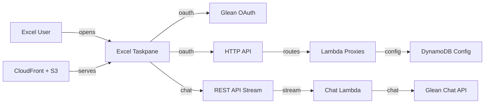

## Description

Glean in Excel is a Microsoft Excel taskpane add-in for workbook-grounded assistance. Users sign in with Glean OAuth, select spreadsheet data, ask questions, answer Glean clarification prompts, and review or auto-apply suggested workbook updates. The solution is designed as a customer-deployable AWS reference with Glean-styled UI patterns and Microsoft 365 centralized deployment support.

## Architecture



The Excel add-in is served from CloudFront and S3. CloudFront forwards OAuth, config, and diagnostics routes to API Gateway HTTP API, while `/api/chat` is routed to a Regional REST API with Lambda response streaming for long-running Glean answers. DynamoDB stores deployment configuration such as the cached DCR client and admin emails.

## AI Deploy Prompt

```markdown
You are helping me adopt a Glean Solutions Library reference: Glean in Excel.
Source: https://github.com/gleanwork/sl-glean-microsoft-excel-addin

Before doing anything, ask me which adoption path I want:

  Path A — Deploy as-is
  Path B — Adopt patterns

Wait for my answer before generating commands or code.

---

## Solution overview
A Microsoft Excel taskpane add-in that lets users sign in with Glean OAuth, ask Glean about selected workbook data, answer Glean clarification prompts, and review or auto-apply proposed cell updates. The reference deploys to AWS with S3, CloudFront, API Gateway HTTP API, API Gateway REST API response streaming, Lambda, and DynamoDB.

## How Glean is integrated
- Glean OAuth PKCE is implemented in `src/services/oauth.ts`, with DCR registration through `backend/src/handlers/oauthRegister.ts` and static-client token exchange through `backend/src/handlers/oauthToken.ts`.
- Glean Chat API is called by `backend/src/handlers/chatStream.ts` through a Regional REST API response-streaming route; the frontend builds workbook-grounded prompts in `src/services/chat.ts`.
- Excel workbook context is captured in `src/services/excel.ts` using Office.js and sent only as a capped preview: selected range up to 25x15, workbook fallback up to 25x15 across sampled sheets, and 25k total characters.
- Glean clarification questions are parsed from `ARTIFACT_USER_QUESTIONS` artifact fragments in `src/services/chat.ts` and rendered/submitted from `src/App.tsx`.
- Preview-before-write and auto-apply edit behavior are implemented in `src/App.tsx` and validated by `src/services/actions.ts`.

## Path A — Deploy as-is
Outcome: Deploy this reference into your AWS account against your Glean instance.

### Phase 1 — Initial deploy

Required configuration:
- `AWS_PROFILE`, `AWS_REGION`, `STACK_NAME`, `DEPLOYMENT_ID`
- `DOMAIN_NAME`, normally `gleaninexcel.gleandemo.com` for the test run
- `CERTIFICATE_ARN` for an ACM certificate in `us-east-1`
- `ARTIFACT_BUCKET`
- `GLEAN_INSTANCE`
- `OAUTH_CLIENT_TYPE`, preferably `dcr`
- `GLEAN_OAUTH_CLIENT_ID` and `GLEAN_OAUTH_CLIENT_SECRET` only for static OAuth
- `ADMIN_EMAILS`

Steps:
1. Copy `deployment/config/prod.env.example` to `deployment/config/prod.env`.
2. Fill the AWS, domain, certificate, Glean instance, OAuth, and admin values.
3. Run `./deployment/scripts/deploy-infrastructure.sh prod`.
4. Point DNS for `DOMAIN_NAME` to the CloudFront distribution output.
5. Run `./deployment/scripts/deploy-app.sh prod`.
6. Install `https://<DOMAIN_NAME>/manifest.xml` through Microsoft 365 centralized deployment or sideload it for testing.

Validation: open Excel, launch Glean, sign in, select a range, ask a question, answer a clarification prompt if Glean asks one, review a proposed update, and apply it to a small test range.

### Phase 2 — Evolve for your organization

After the test run works, review custom domain ownership, OAuth mode, admin policy, write-back controls, workbook-preview policy, logging/monitoring, WAF rules, CI/CD, and customer security requirements before broad rollout.

## Path B — Adopt patterns
Outcome: Bring the integration patterns into an existing Office add-in or internal spreadsheet workflow.

Do not deploy this repo. Instead:
1. Read `src/services/oauth.ts`, `src/services/excel.ts`, `src/services/chat.ts`, `src/services/actions.ts`, and `backend/src/handlers/*.ts`.
2. Map OAuth, selected-range capture, chat proxying, and write confirmation into the target app.
3. Preserve user-scoped OAuth and preview-before-write behavior.
4. Add Glean Agents API only if the target workflow needs configured agent-backed skills.

## Anti-goals (all paths)
- No committed OAuth secrets, AWS credentials, generated manifests, real customer data, or Glean tokens.
- No manual user-entered Glean API tokens for production.
- No workbook writes without a visible preview and user approval unless the user explicitly enables auto-apply edits.
- No agent IDs or Agents API dependency for the v1 general assistant.
```

## LLM Context

```markdown
# Glean in Excel

## Purpose
A customer-deployable Microsoft Excel add-in that brings Glean Chat into Excel with workbook context, structured clarification questions, and safe write-back review.

## Architecture
- Frontend: React + TypeScript Office.js taskpane, hosted as static files.
- Backend: API Gateway HTTP API + Lambda for OAuth/config/diagnostics, and API Gateway REST API + streaming Lambda for Glean Chat.
- Auth: Glean OAuth Authorization Code + PKCE; DCR default, static-client fallback.
- Data: DynamoDB config table for DCR cache and admin emails.
- Infra: CloudFormation/SAM, S3, CloudFront, API Gateway, Lambda, DynamoDB, IAM, ACM.

## Glean Integration Points
1. `src/services/oauth.ts` and `backend/src/handlers/oauthRegister.ts` — Glean OAuth PKCE and Dynamic Client Registration.
2. `backend/src/handlers/oauthToken.ts` — static OAuth token exchange with client secret kept server-side.
3. `backend/src/handlers/chatStream.ts` — Glean Chat API streaming proxy using user-scoped OAuth tokens.
4. `src/services/chat.ts` — workbook-grounded prompt construction, `chatId` continuation, follow-up prompts, and `ARTIFACT_USER_QUESTIONS` parsing.

## Adoption Paths
- Deploy as-is: use the AWS deployment scripts and install the generated Excel manifest.
- Adopt patterns: port OAuth, chat proxy, Excel context capture, and preview-before-write into another add-in or spreadsheet app.

## Files that are the integration
- `src/App.tsx` — taskpane UX, sign-in, chat, clarification questions, edit modes, preview-before-write.
- `src/services/excel.ts` — Office.js selected-range context and write-back.
- `src/services/oauth.ts` — frontend OAuth PKCE flow.
- `backend/src/handlers/*.ts` — Lambda API layer.
- `deployment/cloudformation.yaml` — AWS infrastructure.
```
