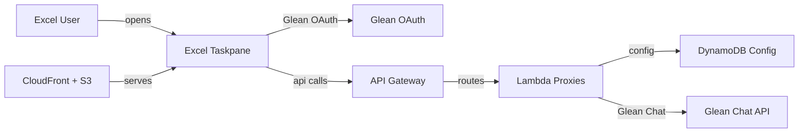

## Description

Glean in Excel is a customer-deployable Microsoft Excel taskpane add-in for bringing Glean's enterprise context into spreadsheet work. Users sign in with Glean OAuth, select workbook data, ask questions grounded in a capped workbook preview, answer Glean clarification prompts, and review proposed updates before applying new values, formulas, or tables to Excel. The core experience uses Glean Chat API and does not require customer-created Glean agents.

## Architecture



The Excel taskpane is served from CloudFront and S3, then uses Glean OAuth for user-scoped sign-in. CloudFront routes `/api/config`, `/api/oauth/register`, `/api/oauth/token`, and diagnostics calls to an API Gateway HTTP API backed by Lambda, while `/api/chat` goes through a Regional API Gateway REST API with Lambda response streaming for long-running Glean Chat API requests. DynamoDB stores deployment configuration such as cached Dynamic Client Registration data and admin email configuration.

## AI Deploy Prompt

```markdown
You are helping me adopt a Glean Solutions Library reference: Glean in Excel.
Source: https://github.com/gleanwork/sl-glean-microsoft-excel-addin

Before doing anything, ask me which adoption path I want:

  Path A — Deploy as-is (deploy this reference; evolve it for your organization)
  Path B — Adopt patterns (bring the Excel/Glean patterns into an add-in or spreadsheet workflow we already own)

Wait for my answer before generating commands, changing files, or deploying anything.

---

## Solution overview
A Microsoft Excel taskpane add-in that lets users sign in with Glean OAuth, ask Glean about selected workbook data using enterprise context, continue a Glean Chat conversation with `chatId`, answer artifact-based clarification questions, and review or auto-apply proposed workbook updates to cells, formulas, or tables. The reference deploys to AWS with S3, CloudFront, API Gateway HTTP API, API Gateway REST API response streaming, Lambda, DynamoDB, ACM, and optional Route53 automation.

## How Glean is integrated
- `src/services/oauth.ts` implements Glean OAuth Authorization Code with PKCE. It requests the `chat search` scopes, redirects to `https://<DOMAIN_NAME>/oauth-callback.html`, starts DCR through `/api/oauth/register`, exchanges authorization codes through `/api/oauth/token`, and refreshes tokens when possible.
- `backend/src/handlers/oauthRegister.ts` calls `https://<GLEAN_INSTANCE>-be.glean.com/oauth/register`, creates a public DCR client with `token_endpoint_auth_method: "none"`, pins the redirect URI to the deployed domain, and caches the resulting `client_id` in DynamoDB.
- `backend/src/handlers/oauthToken.ts` forwards code and refresh-token exchanges to `https://<GLEAN_INSTANCE>-be.glean.com/oauth/token`; `GLEAN_OAUTH_CLIENT_SECRET` is only used server-side when `OAUTH_CLIENT_TYPE=static`.
- `backend/src/handlers/chatStream.ts` proxies the user-scoped bearer token to `https://<GLEAN_INSTANCE>-be.glean.com/rest/api/v1/chat` with `X-Glean-Auth-Type: OAUTH`, returns Server-Sent Events to the browser, sends heartbeat comments, rejects oversized workbook context above 128 KB, and emits the final Glean response.
- `src/services/chat.ts` builds the workbook-grounded prompt, preserves `chatId`, parses `followUpPrompts`, parses `ARTIFACT_USER_QUESTIONS`, and submits clarification answers through `artifactInfo.action.clarifyingQuestionResponses`.
- `src/services/excel.ts` captures Office.js selected-range context. Selected ranges are capped at 25 rows x 15 columns; workbook fallback previews up to 8 sheets at 25 rows x 15 columns per sheet; total context is capped at 25,000 characters.
- `src/services/actions.ts` and `src/App.tsx` parse `<glean_action>` `writeRange` blocks, render preview-before-write cards, and apply values or formulas to Excel only after user approval unless auto-apply edits is enabled.
- No Glean agent IDs are required for the v1 general Excel assistant. If you propose adding agent-backed skills later, pause and ask the user to configure the required Glean agents in `app.glean.com` and provide the resulting IDs before wiring them.

## Path A — Deploy as-is
Outcome: Deploy this reference into your AWS account against your Glean instance, then evolve it for your organization.

### Phase 1 — Initial deploy

Required deployment inputs in `deployment/config/prod.env`:
- `AWS_PROFILE`
- `AWS_REGION`
- `STACK_NAME`
- `DEPLOYMENT_ID`
- `DOMAIN_NAME`
- `CERTIFICATE_ARN` for an ACM certificate in `us-east-1`
- `ARTIFACT_BUCKET`
- `GLEAN_INSTANCE`
- `OAUTH_CLIENT_TYPE` (`dcr` recommended, `static` fallback)
- `GLEAN_OAUTH_CLIENT_ID` and `GLEAN_OAUTH_CLIENT_SECRET` only when `OAUTH_CLIENT_TYPE=static`
- `ADMIN_EMAILS`
- Optional manifest defaults: `ADDIN_ID`, `ADDIN_VERSION`
- Optional Route53 helper input: `ROUTE53_ZONE_NAME`

Steps:
1. Clone `https://github.com/gleanwork/sl-glean-microsoft-excel-addin`.
2. Run `npm install`.
3. Run `npm run check` and `npm audit --omit=dev` before deploying.
4. Copy `deployment/config/prod.env.example` to `deployment/config/prod.env`.
5. Fill in AWS, domain, artifact bucket, Glean instance, OAuth mode, and admin values. Use `OAUTH_CLIENT_TYPE=dcr` unless the customer's Glean tenant requires a static OAuth client.
6. If using static OAuth, configure a Glean OAuth app with redirect URI `https://<DOMAIN_NAME>/oauth-callback.html`, request only the scopes used by the repo (`chat search`), and keep `GLEAN_OAUTH_CLIENT_SECRET` in the server-side deployment environment only.
7. If an ACM certificate is not ready for `DOMAIN_NAME`, run `./deployment/scripts/provision-certificate.sh prod` after confirming `AWS_PROFILE` and `ROUTE53_ZONE_NAME`.
8. Deploy infrastructure with `./deployment/scripts/deploy-infrastructure.sh prod`.
9. Create or update the Route53 alias with `./deployment/scripts/upsert-route53-alias.sh prod`, or manually point the add-in domain to the CloudFront distribution output.
10. Deploy the frontend assets, runtime config, and generated Office manifest with `./deployment/scripts/deploy-app.sh prod`.
11. Open `https://<DOMAIN_NAME>/manifest.xml` and install it through Microsoft 365 centralized deployment or sideload it for a test user.

Local development and sideloading commands from the repo:
- `npm run dev`
- `npm run dev-certs`
- `DOMAIN_NAME=localhost:3000 GLEAN_INSTANCE=your-instance node deployment/scripts/generate-manifest.mjs`
- `npm run sideload`

Validation:
1. Open Excel and launch the Glean taskpane from the generated manifest.
2. Sign in with Glean OAuth.
3. Select a small populated range and ask `Summarize the selected rows`.
4. Confirm the context preview shows only the sampled range and reports capped context when applicable.
5. Ask a question that returns Glean clarification questions and submit answers.
6. Ask for a small write action, review the update preview, and apply it to a safe test range.
7. Toggle `Auto-apply edits` only on safe test data and confirm updates are applied.
8. Click `New chat`, sign out, and sign back in to verify session reset and token flow.

### Phase 2 — Evolve for your organization

Once Phase 1 is working, ask me about each of the following before making changes; generate a per-item adoption plan and implement only after I confirm:
- OAuth mode: keep DCR as the default if the customer's tenant allows it; if a static OAuth client is required, move `GLEAN_OAUTH_CLIENT_SECRET` out of `deployment/config/prod.env` into AWS Secrets Manager or the customer's secret store and inject it during deployment.
- OAuth scope review: verify the deployed app still needs only `chat search`, and do not add scopes without a concrete feature requiring them.
- Domain and manifest rollout: replace test domains and default `ADDIN_ID` values with customer-owned values; maintain a versioned `manifest.xml` process for Microsoft 365 centralized deployment.
- Write-back governance: decide whether `FEATURE_WRITE_BACK` stays enabled, whether `Auto-apply edits` should be hidden or admin-governed, and whether workbook preview fallback should remain enabled for sensitive teams.
- Workbook data handling: preserve selected-range and workbook-preview caps unless the customer explicitly accepts the data handling change; keep UI notices for truncated context.
- Logging: keep prompts, workbook contents, bearer tokens, refresh tokens, and Glean responses out of application logs; set Lambda log retention according to customer policy.
- Security perimeter: add WAF rules to CloudFront or API Gateway if required, keep CORS scoped to `https://<DOMAIN_NAME>`, and review the CloudFront behaviors for `/api/chat*` and other `/api/*` traffic.
- Operations: add CloudWatch alarms for Lambda errors, API Gateway 5xx responses, streaming timeouts, OAuth failures, and CloudFront 4xx/5xx rates.
- Deployment automation: move `./deployment/scripts/*.sh` from a developer laptop into customer CI using OIDC or an equivalent least-privilege deployment role.
- Admin config: decide whether `ADMIN_EMAILS` from environment is enough or whether the DynamoDB-backed config route should be completed for delegated admin updates.
- Future Glean agents: do not add Agents API or agent IDs unless the customer wants specific spreadsheet skills beyond the general Glean Chat assistant. If they do, pause and have them configure agents in `app.glean.com`, then provide the resulting IDs for configuration.

## Path B — Adopt patterns
Outcome: Bring the integration patterns into an app you already own, without deploying this repo.

Do not deploy this repo. Instead:
1. Read these integration files in the source repo:
   - `src/services/oauth.ts` — browser-side OAuth PKCE, DCR client-id discovery, static-client fallback, token refresh, and `chat search` scope request.
   - `backend/src/handlers/oauthRegister.ts` — server-side Dynamic Client Registration and DynamoDB DCR cache.
   - `backend/src/handlers/oauthToken.ts` — server-side OAuth token and refresh-token proxy; static-client secret stays off the browser.
   - `backend/src/handlers/chatStream.ts` — Glean Chat API proxy, `X-Glean-Auth-Type: OAUTH`, Lambda response streaming, SSE final/error events, heartbeat comments, and request-size guard.
   - `src/services/chat.ts` — workbook-grounded prompt construction, `chatId` continuation, `followUpPrompts`, and `ARTIFACT_USER_QUESTIONS` parsing/submission.
   - `src/services/excel.ts` — Office.js selected-range capture, capped workbook fallback, preview tables, and write-back execution.
   - `src/services/actions.ts` and `src/App.tsx` — `<glean_action>` parsing, rectangular write validation, edit-mode toggle, preview-before-write, clarification-question UI, and final apply/cancel flow.
   - `deployment/cloudformation.yaml` — S3/CloudFront hosting, API Gateway HTTP API routes, API Gateway REST API streaming route for `/api/chat`, Lambda functions, DynamoDB config table with point-in-time recovery, IAM, ACM, and CloudFront routing.
2. Ask me to point you at the target add-in or spreadsheet workflow and describe its frontend framework, Office.js usage, backend runtime, existing authentication model, deployment environment, and whether workbook write-back is allowed.
3. Map the patterns into the target:
   - Port OAuth PKCE and DCR/static-client selection into the target auth flow, preserving the deployed redirect URI and `chat search` scopes.
   - Port the OAuth register/token handlers into a backend that can keep static OAuth secrets server-side.
   - Port the Glean Chat API proxy as a same-origin `/api/chat` endpoint. If the target cannot support streaming, explicitly call out the tradeoff before replacing the repo's SSE behavior.
   - Port selected-range capture and workbook-preview caps before sending workbook context to Glean.
   - Port clarification-question parsing for `ARTIFACT_USER_QUESTIONS` if the target needs structured clarification flows.
   - Port preview-before-write and rectangular write validation before enabling workbook edits.
4. Propose a minimum viable port: OAuth sign-in, selected-range capture, Glean Chat proxy, and a single "Ask or change this range with Glean" composer with no write-back. Add write-back, clarification cards, and auto-apply only after I approve.
5. Flag preconditions before writing code:
   - The target must have a backend path for OAuth token exchange and Glean Chat proxying; do not place static OAuth secrets or long-lived Glean tokens in the browser.
   - The target must be allowed to send selected workbook context to Glean under the customer's data policy.
   - The target's Office manifest must request the permissions needed for selected-range reads and any write-back behavior.
   - The target's reverse proxy must support streaming or the implementation must degrade intentionally with a documented timeout and UX plan.
   - Agent IDs are not part of the v1 integration; if the target wants agent-backed spreadsheet skills later, pause for `app.glean.com` configuration and user-provided IDs.

## Anti-goals (all paths)
- Do not commit `deployment/config/prod.env`, generated `manifest.xml`, OAuth secrets, AWS credentials, real workbook data, bearer tokens, refresh tokens, Glean responses, or customer tenant details.
- Do not ask users to paste Glean API tokens; use Glean OAuth with PKCE.
- Do not put `GLEAN_OAUTH_CLIENT_SECRET` in frontend runtime config or browser code.
- Do not send entire workbooks by default; preserve capped selected-range or workbook-preview behavior unless the user explicitly approves a data handling change.
- Do not apply workbook writes without visible preview and user approval unless the user deliberately enables auto-apply edits.
- Do not add Agents API, agent IDs, file upload, custom functions, third-party telemetry, or extra cloud services unless the user asks for that scope.
```

## LLM Context

```markdown
# Glean in Excel — Microsoft Excel taskpane add-in for workbook-grounded Glean Chat

## Purpose

A customer-deployable Excel add-in that brings Glean Chat and enterprise context into Microsoft Excel with user-scoped OAuth, selected-range context, structured clarification questions, and safe write-back review for cells, formulas, and tables. It is a general Excel-aware assistant and does not require customer-created Glean agents for the core experience.

## Architecture

- Frontend: React + TypeScript + Vite Office.js taskpane in `src/`, with `taskpane.html`, `oauth-dialog.html`, and `oauth-callback.html` as Vite entry points.
- Office integration: `manifest.xml.example` declares a Workbook taskpane add-in with `ReadWriteDocument`, `ExcelApi` 1.9, and `DialogApi` 1.1.
- Auth: Glean OAuth Authorization Code with PKCE in `src/services/oauth.ts`; DCR is the default path through `backend/src/handlers/oauthRegister.ts`, with static-client token exchange through `backend/src/handlers/oauthToken.ts` when required.
- Backend: API Gateway HTTP API plus Lambda for config, OAuth registration/token exchange, and diagnostics; API Gateway REST API plus Lambda response streaming for `/api/chat`.
- Data: DynamoDB config table stores cached DCR client data and admin email configuration; point-in-time recovery is enabled in `deployment/cloudformation.yaml`.
- Hosting: S3 private bucket behind CloudFront; CloudFront routes `/api/chat*` to the REST API origin and other `/api/*` paths to the HTTP API origin.
- Deployment: CloudFormation/SAM template in `deployment/cloudformation.yaml`; helper scripts in `deployment/scripts/` package/deploy infrastructure, generate runtime config, generate the Office manifest, sync assets to S3, invalidate CloudFront, provision ACM, and update Route53.

## Glean Integration Points

1. Glean OAuth PKCE and DCR — `src/services/oauth.ts` builds the authorization URL with `chat search` scopes and redirect URI `/oauth-callback.html`; `backend/src/handlers/oauthRegister.ts` calls Glean `/oauth/register`; `backend/src/handlers/oauthToken.ts` exchanges authorization and refresh tokens through Glean `/oauth/token`.
2. Glean Chat API — `backend/src/handlers/chatStream.ts` calls `https://<GLEAN_INSTANCE>-be.glean.com/rest/api/v1/chat` with the user bearer token and `X-Glean-Auth-Type: OAUTH`, then returns SSE progress/final/error events to the taskpane.
3. Workbook-grounded prompts — `src/services/chat.ts` builds prompts that tell Glean it is helping inside Excel and includes selected-range or capped workbook context from `src/services/excel.ts`.
4. Clarification flow — `src/services/chat.ts` parses `ARTIFACT_USER_QUESTIONS`, sends `artifactInfo.action.clarifyingQuestionResponses`, and `src/App.tsx` renders question cards and answer summaries.
5. Follow-up prompts and chat continuity — `src/services/chat.ts` extracts `followUpPrompts`; `src/App.tsx` stores and resets `chatId` for persistent Glean Chat context.
6. Safe write-back — Glean can emit a `<glean_action>` `writeRange` block; `src/services/actions.ts` validates it and `src/App.tsx` requires a preview approval before `src/services/excel.ts` writes values or formulas to Excel, unless auto-apply edits is explicitly enabled.

## Adoption Paths

- **Deploy as-is** (deploy prompt's Path A): use `npm install`, `npm run check`, `deployment/config/prod.env`, `./deployment/scripts/deploy-infrastructure.sh prod`, `./deployment/scripts/upsert-route53-alias.sh prod`, and `./deployment/scripts/deploy-app.sh prod` to host the add-in in the customer's AWS account. Validate through Excel by signing in with Glean, asking about a selected range, answering a Glean clarification prompt, reviewing a write preview, applying a safe test update, starting a new chat, and signing out/in. Then evolve OAuth secret handling, domain/manifest rollout, write-back governance, workbook context policy, logging, WAF, alarms, CI/CD, and admin config.
- **Adopt patterns** (deploy prompt's Path B): keep the repo as a reference and port the OAuth PKCE/DCR flow, OAuth token proxy, Glean Chat streaming proxy, selected-range capture, `ARTIFACT_USER_QUESTIONS` handling, and preview-before-write pattern into an existing Office add-in or spreadsheet workflow. Start with OAuth + selected-range context + Glean Chat, then add write-back for cells, formulas, or tables and clarification UI after approval.

## Files that are the integration (for pattern adoption)

- `src/services/oauth.ts` — browser OAuth PKCE, DCR lookup, static client fallback, token refresh.
- `backend/src/handlers/oauthRegister.ts` — Dynamic Client Registration against Glean and DynamoDB DCR cache.
- `backend/src/handlers/oauthToken.ts` — server-side OAuth token and refresh-token proxy.
- `backend/src/handlers/chatStream.ts` — Glean Chat API proxy with Lambda response streaming and SSE events.
- `src/services/chat.ts` — workbook-grounded prompt construction, `chatId`, follow-up prompts, clarification artifact parsing and response.
- `src/services/excel.ts` — Office.js selected-range sampling, capped workbook fallback, preview tables, and write-back execution.
- `src/services/actions.ts` — `<glean_action>` `writeRange` parsing and rectangular write validation.
- `src/App.tsx` — taskpane UX for sign-in, selection refresh, chat, clarification questions, edit mode, preview-before-write, apply/cancel, and session reset.
- `deployment/cloudformation.yaml` — AWS runtime wiring for CloudFront/S3, API Gateway HTTP API, API Gateway REST streaming API, Lambda, DynamoDB, IAM, and ACM.
- `deployment/scripts/` — deployment, manifest generation, runtime config generation, ACM provisioning, and Route53 alias helpers.
```
